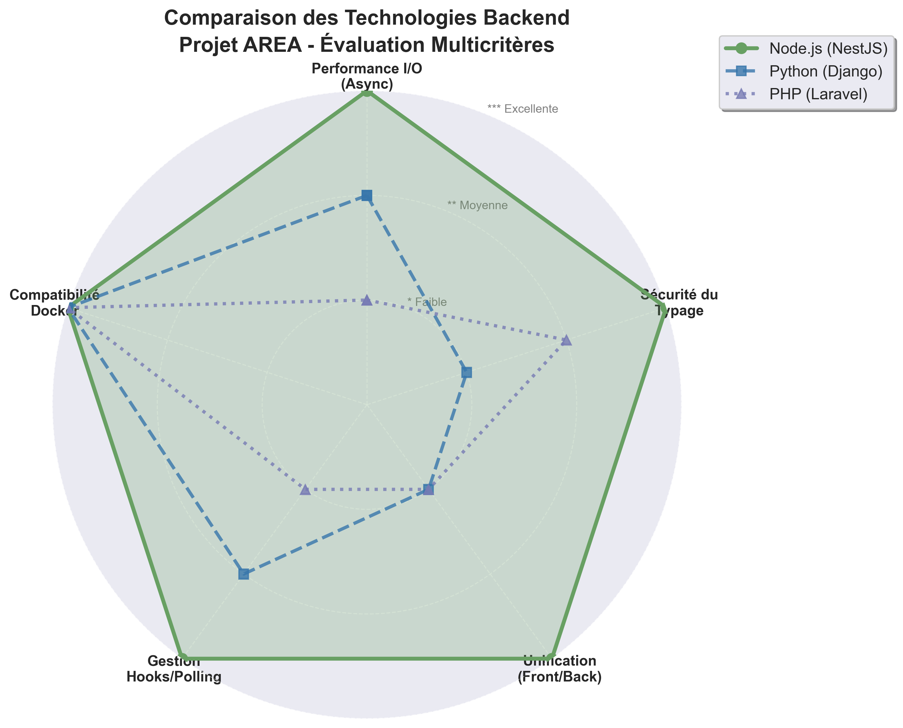

# State of the Art – Backend Architecture

## 1. Context

Within the AREA project, the application server plays a central role as the "orchestrator." It is the only component allowed to contain the project's business logic.

Its main responsibilities are:

- **Expose a REST API** for Web and Mobile clients.
- **Manage user authentication** and OAuth2 integration with third-party services.
- **Orchestrate automations** by connecting _Actions_ and _REActions_ via a _Hooks_ system.
- **Act as a "glue"** between the different software components and selected external APIs.

The architecture must be container-based and deployable via Docker Compose.

### Evaluation Criteria

The criteria used to evaluate backend technologies are:

- **I/O Performance**: Ability to handle multiple simultaneous external API calls without blocking the server (essential for the "glue" role).
- **Type Safety**: Code robustness to facilitate teamwork and maintenance.
- **Ecosystem**: Availability of libraries to easily integrate required third-party services.
- **Unification**: Possibility to share language or concepts with the frontend.
- **Data Integrity**: Ability to reliably manage complex relationships (Users <-> Services <-> AREA).

### Technologies Studied

The technologies studied for the application server are:

- **Node.js (NestJS)**: Asynchronous JavaScript runtime with a structured TypeScript framework.
- **Python (Django/Flask)**: Popular language for scripting and web development.
- **PHP (Laravel/Symfony)**: Historic web language, working on a synchronous request/response model.

---

## 2. Technology Analysis

### 2.1 Node.js (NestJS + TypeScript)

#### Description

Node.js is a JavaScript runtime built on the V8 engine, using a non-blocking I/O model. NestJS is a framework enforcing modular architecture and TypeScript usage.

#### Advantages

- **Non-Blocking Architecture**: Ideal for the "glue" role, allowing multiple external API calls (Google, Outlook, etc.) to be awaited simultaneously without slowing down the server.
- **Strong Typing (TypeScript)**: Secures complex data structures (Actions, Reactions) and reduces bugs.
- **Full-Stack Unification**: Same language (JS/TS) as Web and Mobile clients, facilitating team mobility.
- **NPM Ecosystem**: Immediate access to thousands of packages for OAuth2 and required third-party APIs.

#### Disadvantages

- **NestJS Learning Curve**: Requires understanding dependency injection (DI) and decorators.

#### Relevance for AREA

**Highly suitable**: Native asynchronous handling is perfect for the Hook mechanism that periodically checks for events.

---

### 2.2 Python (Django / Flask)

#### Description

Python is an interpreted language valued for its readability. Django is a full-featured framework ("batteries included"), while Flask is lighter.

#### Advantages

- **Simplicity**: Clear and concise syntax, quick to learn.
- **Prototyping**: Allows rapid POC (_Proof of Concept_) development.
- **Libraries**: Excellent support for scripting and automation.

#### Disadvantages

- **Synchronous Model (GIL)**: Less performant for handling massive concurrent I/O (multiple API calls) without complex AsyncIO configuration.
- **Dynamic Typing**: Risk of type errors at runtime, especially on a long-term project with many data structures.
- **Fragmentation**: Requires mastering two different languages (Python for backend, JS for frontend).

#### Relevance for AREA

**Moderately suitable**: Capable, but complicates the team’s tech stack (two languages) for questionable performance gains on this type of API integration project.

---

### 2.3 PHP (Laravel / Symfony)

#### Description

PHP is designed for the web, traditionally operating in a synchronous, "share-nothing" request model.

#### Advantages

- **Maturity**: Very stable frameworks with exhaustive documentation.
- **Deployment**: Easy to containerize with Docker.

#### Disadvantages

- **Blocking Architecture**: The synchronous model makes permanent Hooks or efficient polling difficult without heavy external tools.
- **Philosophy**: Designed to serve HTML pages, less suitable as a pure JSON API aggregator in real-time.
- **Typing**: Less strict than TypeScript, which can be a limitation for the rigor expected in a group project.

#### Relevance for AREA

**Poorly suited**: Managing asynchronous events (Hooks) conflicts with PHP's traditional architecture.

---

## 3. Comparative Summary

| Criterion                    | Node.js (NestJS)   | Python (Django) | PHP (Laravel) |
| :--------------------------- | :----------------- | :-------------- | :------------ |
| **I/O Performance (Async)**  | ⭐⭐⭐ Excellent   | ⭐⭐ Medium     | ⭐ Poor       |
| **Type Safety**              | ⭐⭐⭐ Strong (TS) | ⭐ Poor         | ⭐⭐ Medium   |
| **Front/Back Unification**   | ⭐⭐⭐ Yes         | ❌ No           | ❌ No         |
| **Hooks/Polling Management** | ⭐⭐⭐ Native      | ⭐⭐ Medium     | ⭐ Complex    |
| **Docker Compatibility**     | ⭐⭐⭐ Simple      | ⭐⭐⭐ Simple   | ⭐⭐⭐ Simple |
| **Suitability for AREA**     | ⭐⭐⭐ Excellent   | ⭐⭐ Fair       | ⭐ Poor       |

---

## 4. Security Considerations

Security is paramount in the AREA project, as it handles user credentials, OAuth tokens, and integrates with multiple third-party services. The chosen stack (Node.js/NestJS + PostgreSQL + Prisma) provides robust built-in security features.

### 4.1 Authentication & Authorization

- **JWT Tokens**: Stateless authentication using JSON Web Tokens with configurable expiration
- **OAuth2 Integration**: Secure third-party authentication via Discord, Google, and GitHub
- **Password Hashing**: bcrypt algorithm with salt rounds for storing user passwords
- **Role-Based Access Control (RBAC)**: User roles (admin, user) to restrict access to sensitive endpoints

### 4.2 Input Validation & Sanitization

- **NestJS Pipes**: Automatic validation using `class-validator` decorators
- **DTO Validation**: Strict type checking on all API inputs to prevent malformed data
- **Prisma Type Safety**: ORM-level validation ensuring data integrity before database queries

### 4.3 API Protection

- **Rate Limiting**: Throttling mechanisms to prevent DDoS and brute-force attacks
- **CORS Configuration**: Whitelist of allowed frontend origins (Web + Mobile URLs)
- **Request Size Limits**: Body parser limits to prevent memory exhaustion attacks
- **Helmet.js**: Automatically sets secure HTTP headers (CSP, HSTS, X-Frame-Options)

### 4.4 Data Security

- **SQL Injection Protection**: Prisma's parameterized queries eliminate SQL injection risks
- **XSS Prevention**: Automatic escaping of user-generated content
- **CSRF Protection**: Token-based verification for state-changing operations
- **Environment Variables**: Sensitive data (API keys, secrets) stored outside codebase using `.env` files

### 4.5 Third-Party API Security

- **Token Storage**: OAuth refresh tokens securely stored in database (encrypted at rest)
- **Minimal Permissions**: Request only necessary scopes from OAuth providers
- **Token Rotation**: Automatic refresh token renewal to limit exposure window
- **API Key Management**: Centralized configuration with validation on startup

### 4.6 Database Security

- **ACID Transactions**: PostgreSQL ensures data consistency and integrity
- **Encrypted Connections**: TLS/SSL for database communications
- **Least Privilege Principle**: Database user with minimal required permissions
- **Regular Backups**: Automated backup strategy to prevent data loss

### 4.7 Docker & Deployment Security

- **Non-Root Containers**: Services run with limited user privileges
- **Network Isolation**: Internal Docker network for service-to-service communication
- **Secret Management**: Docker secrets for sensitive configuration in production
- **Image Scanning**: Vulnerability scanning of Docker images before deployment

### 4.8 Security Best Practices

- **Dependency Scanning**: Regular `npm audit` to detect vulnerable packages
- **Security Headers**: Implementation of OWASP recommended HTTP headers
- **Logging & Monitoring**: Audit logs for authentication attempts and sensitive operations
- **Error Handling**: Generic error messages to avoid information leakage

---

## 5. Conclusion and Technology Choice

### 5.1 Selected Stack: Node.js / PostgreSQL / Prisma

Based on the comparative analysis and project requirements, the following stack was chosen:

- **Server:** Node.js with NestJS
- **Database:** PostgreSQL
- **ORM:** Prisma

### 5.2 Justification

#### Backend: Node.js vs PHP/Python

**Node.js** was chosen for its asynchronous nature, ideal for the "glue" role between services. Unlike PHP (synchronous) or Python (often blocking by default), Node.js can efficiently handle Hook polling without blocking user requests. Additionally, using **TypeScript** across the project unifies the team’s skills.

#### Database: PostgreSQL

The project requires a rigorous structure to manage users and AREA relationships. **PostgreSQL** ensures data integrity (ACID), guaranteeing that each _Action_ is correctly linked to a _Reaction_, which would be riskier with a NoSQL solution.

#### ORM: Prisma

**Prisma** was chosen for end-to-end type safety. It generates a TypeScript client synchronized with the database, simplifying schema evolution when adding new services and drastically reducing bugs.

### 5.3 Expected Benefits

This solution ensures:

- **Robustness**: Strict typing and SQL relational integrity.
- **Responsiveness**: Optimal I/O management for interactions with third-party APIs.
- **Maintainability**: Structured and unified code, allowing any team member to take over the project.
- **Compliance**: Deployable architecture via Docker Compose with clearly separated business logic.
- **Security**: Multi-layered security approach protecting user data and API integrations.

---

# Version Française

---

# State of the Art – Backend Architecture

## 1. Contexte

Dans le cadre du projet AREA, le serveur d'application joue un rôle central de "chef d'orchestre". Il est le seul composant autorisé à embarquer la logique métier (_business logic_) du projet.

Ses responsabilités principales sont :

- **Exposer une API REST** pour les clients Web et Mobile.
- **Gérer l'authentification** des utilisateurs et l'intégration OAuth2 avec des services tiers.
- **Orchestrer les automatisations** en interconnectant des _Actions_ et des _REActions_ via un système de _Hooks_.
- **Agir comme une "colle" (_glue_)** entre les différentes briques logicielles et API externes sélectionnées.

L'architecture doit être construite autour de conteneurs et déployée via Docker Compose.

### Critères d'évaluation

Les critères retenus pour évaluer les technologies backend sont :

- **Performance I/O (Entrées/Sorties)** : Capacité à gérer de multiples appels API externes simultanément sans bloquer le serveur (essentiel pour le rôle de "glue").
- **Sécurité du typage** : Robustesse du code pour faciliter le travail en groupe et la maintenance.
- **Écosystème** : Disponibilité de librairies pour intégrer facilement les services tiers demandés.
- **Unification** : Possibilité de partager le langage ou les concepts avec le frontend.
- **Intégrité des données** : Capacité à gérer des relations complexes (Utilisateurs <-> Services <-> AREA) de manière fiable.

### Technologies étudiées

Les technologies étudiées pour le serveur d'application sont :

- **Node.js (NestJS)** : Runtime JavaScript asynchrone avec un framework structuré en TypeScript.
- **Python (Django/Flask)** : Langage populaire pour le script et le web.
- **PHP (Laravel/Symfony)** : Langage historique du web, fonctionnant sur un modèle requête/réponse synchrone.

---

## 2. Analyse des technologies

### 2.1 Node.js (NestJS + TypeScript)

#### Description

Node.js est un environnement d'exécution JavaScript basé sur le moteur V8, utilisant un modèle d'E/S non bloquant. NestJS est un framework qui impose une architecture modulaire et l'utilisation de TypeScript.

#### Avantages

- **Architecture Non-Bloquante** : Idéale pour le rôle de "glue", permettant d'attendre plusieurs réponses d'API externes simultanément (Google, Outlook, etc.) sans ralentir le serveur.
- **Typage Fort (TypeScript)** : Sécurise les structures de données complexes (Actions, Réactions) et réduit les bugs.
- **Unification Full-Stack** : Utilisation du même langage (JS/TS) que les clients Web et Mobile, facilitant la mobilité de l'équipe.
- **Écosystème NPM** : Accès immédiat à des milliers de paquets pour gérer l'OAuth2 et les API tierces demandées par le sujet.

#### Inconvénients

- **Courbe d'apprentissage NestJS** : Nécessite de comprendre l'injection de dépendances (DI) et les décorateurs.

#### Pertinence pour AREA

**Très adaptée** : La gestion native de l'asynchronisme est parfaite pour le mécanisme de Hook qui doit vérifier périodiquement si des événements se sont produits.

---

### 2.2 Python (Django / Flask)

#### Description

Python est un langage interprété apprécié pour sa lisibilité. Django est un framework complet ("batteries included"), tandis que Flask est plus léger.

#### Avantages

- **Simplicité** : Syntaxe claire et concise, rapide à prendre en main.
- **Prototypage** : Permet de développer un POC (_Proof of Concept_) très rapidement.
- **Bibliothèques** : Excellent support pour le scripting et l'automatisation.

#### Inconvénients

- **Modèle Synchrone (GIL)** : Moins performant pour gérer massivement des I/O concurrents (appels API multiples) sans configuration complexe (AsyncIO).
- **Typage Dynamique** : Risque d'erreurs de type lors de l'exécution, surtout sur un projet long impliquant de nombreuses structures de données.
- **Fragmentation** : Nécessite de maîtriser deux langages différents (Python pour le back, JS pour le front).

#### Pertinence pour AREA

**Moyennement adapté** : Bien que capable, il complexifie la stack technique de l'équipe (deux langages) pour un gain de performance discutable sur ce type de projet d'intégration API.

---

### 2.3 PHP (Laravel / Symfony)

#### Description

PHP est conçu pour le web, fonctionnant traditionnellement sur un modèle synchrone où chaque requête est isolée ("Share-nothing").

#### Avantages

- **Maturité** : Frameworks très stables et documentation exhaustive.
- **Déploiement** : Facile à conteneuriser avec Docker.

#### Inconvénients

- **Architecture Bloquante** : Le modèle synchrone rend difficile la mise en œuvre de _Hooks_ permanents ou de _polling_ efficace sans outils externes lourds.
- **Philosophie** : Conçu pour servir des pages HTML, moins adapté pour être un pur agrégateur d'API JSON en temps réel.
- **Typage** : Moins strict que TypeScript, ce qui peut être un frein pour la rigueur attendue sur ce projet de groupe.

#### Pertinence pour AREA

**Peu adapté** : Le besoin de gérer des événements asynchrones (Hooks) entre en conflit avec l'architecture traditionnelle de PHP.

---

## 3. Synthèse comparative

| Critère                       | Node.js (NestJS)  | Python (Django) | PHP (Laravel) |
| :---------------------------- | :---------------- | :-------------- | :------------ |
| **Performance I/O (Async)**   | ⭐⭐⭐ Excellente | ⭐⭐ Moyenne    | ⭐ Faible     |
| **Sécurité du Typage**        | ⭐⭐⭐ Forte (TS) | ⭐ Faible       | ⭐⭐ Moyenne  |
| **Unification (Front/Back)**  | ⭐⭐⭐ Oui        | ❌ Non          | ❌ Non        |
| **Gestion des Hooks/Polling** | ⭐⭐⭐ Native     | ⭐⭐ Moyenne    | ⭐ Complexe   |
| **Compatibilité Docker**      | ⭐⭐⭐ Simple     | ⭐⭐⭐ Simple   | ⭐⭐⭐ Simple |
| **Adapté au projet AREA**     | ⭐⭐⭐ Excellent  | ⭐⭐ Correct    | ⭐ Faible     |

---

## 4. Considérations de Sécurité

La sécurité est primordiale dans le projet AREA, car il gère des identifiants utilisateurs, des tokens OAuth et s'intègre avec plusieurs services tiers. La stack choisie (Node.js/NestJS + PostgreSQL + Prisma) offre des fonctionnalités de sécurité robustes intégrées.

### 4.1 Authentification & Autorisation

- **Tokens JWT** : Authentification sans état utilisant JSON Web Tokens avec expiration configurable
- **Intégration OAuth2** : Authentification sécurisée via Discord, Google et GitHub
- **Hachage de Mots de Passe** : Algorithme bcrypt avec salage pour stocker les mots de passe utilisateurs
- **Contrôle d'Accès Basé sur les Rôles (RBAC)** : Rôles utilisateurs (admin, user) pour restreindre l'accès aux endpoints sensibles

### 4.2 Validation & Assainissement des Entrées

- **NestJS Pipes** : Validation automatique utilisant les décorateurs `class-validator`
- **Validation DTO** : Vérification stricte des types sur toutes les entrées API pour prévenir les données malformées
- **Sécurité de Type Prisma** : Validation au niveau de l'ORM garantissant l'intégrité des données avant les requêtes

### 4.3 Protection de l'API

- **Rate Limiting** : Mécanismes de limitation pour prévenir les attaques DDoS et force brute
- **Configuration CORS** : Liste blanche des origines frontend autorisées (URLs Web + Mobile)
- **Limites de Taille de Requête** : Limites du body parser pour éviter les attaques d'épuisement mémoire
- **Helmet.js** : Définit automatiquement les en-têtes HTTP sécurisés (CSP, HSTS, X-Frame-Options)

### 4.4 Sécurité des Données

- **Protection contre l'Injection SQL** : Les requêtes paramétrées de Prisma éliminent les risques d'injection SQL
- **Prévention XSS** : Échappement automatique du contenu généré par les utilisateurs
- **Protection CSRF** : Vérification basée sur des tokens pour les opérations modifiant l'état
- **Variables d'Environnement** : Données sensibles (clés API, secrets) stockées hors du code via fichiers `.env`

### 4.5 Sécurité des API Tierces

- **Stockage des Tokens** : Tokens de rafraîchissement OAuth stockés de manière sécurisée en base (chiffrés au repos)
- **Permissions Minimales** : Demande uniquement des scopes nécessaires aux fournisseurs OAuth
- **Rotation des Tokens** : Renouvellement automatique des refresh tokens pour limiter la fenêtre d'exposition
- **Gestion des Clés API** : Configuration centralisée avec validation au démarrage

### 4.6 Sécurité de la Base de Données

- **Transactions ACID** : PostgreSQL garantit la cohérence et l'intégrité des données
- **Connexions Chiffrées** : TLS/SSL pour les communications avec la base de données
- **Principe du Moindre Privilège** : Utilisateur de base de données avec permissions minimales requises
- **Sauvegardes Régulières** : Stratégie de sauvegarde automatisée pour prévenir la perte de données

### 4.7 Sécurité Docker & Déploiement

- **Conteneurs Non-Root** : Services exécutés avec privilèges utilisateur limités
- **Isolation Réseau** : Réseau Docker interne pour la communication service-à-service
- **Gestion des Secrets** : Docker secrets pour la configuration sensible en production
- **Analyse d'Images** : Scan de vulnérabilités des images Docker avant déploiement

### 4.8 Bonnes Pratiques de Sécurité

- **Scan des Dépendances** : `npm audit` régulier pour détecter les paquets vulnérables
- **En-têtes de Sécurité** : Implémentation des en-têtes HTTP recommandés par l'OWASP
- **Journalisation & Surveillance** : Logs d'audit pour les tentatives d'authentification et opérations sensibles
- **Gestion des Erreurs** : Messages d'erreur génériques pour éviter les fuites d'information

---

## 5. Conclusion et choix technologique

### 5.1 Choix retenu : Stack Node.js / PostgreSQL / Prisma

Au regard de l'analyse comparative et des besoins du projet, la stack suivante est retenue :

- **Serveur :** Node.js avec NestJS
- **Base de données :** PostgreSQL
- **ORM :** Prisma

### 5.2 Justification du choix

#### Backend : Node.js vs PHP/Python

Le choix de **Node.js** est motivé par sa nature asynchrone, idéale pour le rôle de "glue" entre les services. Contrairement à PHP (synchrone) ou Python (souvent bloquant par défaut), Node.js peut gérer efficacement le _polling_ des Hooks sans bloquer les requêtes des utilisateurs. De plus, l'utilisation de **TypeScript** sur l'ensemble du projet unifie les compétences de l'équipe.

#### Base de données : PostgreSQL

Le projet nécessite une structure rigoureuse pour gérer les utilisateurs et les liaisons AREA. **PostgreSQL** est choisi pour garantir l'intégrité des données (ACID), assurant que chaque _Action_ est correctement liée à une _Réaction_, ce qui serait plus risqué avec une solution NoSQL.

#### ORM : Prisma

**Prisma** est retenu pour son typage de bout en bout (_Type Safety_). Il permet de générer un client TypeScript synchronisé avec la base de données, facilitant l'évolution du schéma lors de l'ajout de nouveaux services et réduisant drastiquement les bugs.

### 5.3 Bénéfices attendus

Cette solution garantit :

- **Robustesse** : Typage strict et intégrité relationnelle SQL.
- **Réactivité** : Gestion optimale des I/O pour les interactions avec les API tierces.
- **Maintenance** : Code structuré et unifié, facilitant la reprise du projet par n'importe quel membre du groupe.
- **Respect des consignes** : Architecture déployable via Docker Compose et séparant clairement la logique métier.
- **Sécurité** : Approche de sécurité multicouche protégeant les données utilisateurs et les intégrations API.
