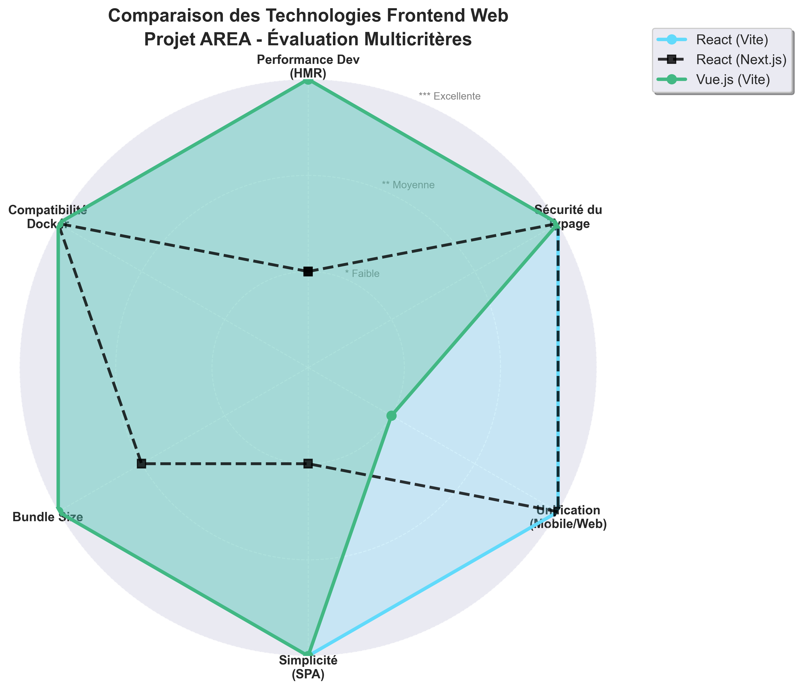

# State of the Art – Frontend Web Architecture

## 1. Context

Within the AREA project, the web client plays a central role as the user interface. It must not contain any business logic: it serves solely as a relay to the REST API exposed by the server.

Its main responsibilities are:

- **Consume the REST API** for all operations (authentication, CRUD of AREAs, service management).
- **Display the user interface** for creating and managing automations (_Actions_ and _REActions_).
- **Handle user authentication** via OAuth2 in coordination with the backend.
- **Provide a modern user experience** with a responsive and intuitive interface.

The architecture must be container-based and deployable via Docker Compose.

### Evaluation Criteria

The criteria used to evaluate frontend technologies are:

- **Development performance (HMR)**: Speed of iteration for rapid development (essential to meet deadlines).
- **Type safety**: Robustness of code to facilitate teamwork and maintenance.
- **Ecosystem**: Availability of UI libraries, state management, and routing solutions.
- **Unification**: Possibility to share language or concepts with the mobile client.
- **Lightweight (Bundle size)**: Final application performance and load times for users.

### Technologies Studied

The technologies studied for the web client are:

- **React (Vite)**: JavaScript library with a modern, ultra-fast build tool.
- **React (Next.js)**: React library with a full-stack framework including SSR/SSG.
- **Vue.js (Vite)**: Progressive JavaScript framework with a modern build tool.

---

## 2. Technology Analysis

### 2.1 React (Vite + TypeScript)

#### Description

React is a JavaScript library for building component-based user interfaces. Vite is a modern build tool that uses native ESM during development and Rollup for production.

#### Advantages

- **Development Performance**: Instant start (~200ms) and ultra-fast HMR (<50ms), ideal for iterative development.
- **Strong Typing (TypeScript)**: Secures data structures (Services, Actions, Reactions) and reduces bugs.
- **Full-Stack Unification**: Same language (JS/TS) and concepts (React) as the mobile client (React Native), facilitating team mobility.
- **NPM Ecosystem**: Immediate access to thousands of packages for UI (shadcn/ui, Material-UI), state management (Zustand), routing (React Router).

#### Disadvantages

- **Choice Required**: Libraries for routing and state management must be selected (unlike an all-in-one framework).

#### Relevance for AREA

**Highly suitable**: Development performance is ideal for a student project with tight deadlines. Unification with React Native allows the entire team to contribute without friction.

---

### 2.2 React (Next.js)

#### Description

Next.js is a full-stack React framework offering server-side rendering (SSR), static site generation (SSG), file-based routing, and numerous automatic optimizations.

#### Advantages

- **Complete Framework**: Routing, automatic optimizations, API routes included.
- **Production-ready**: Numerous optimizations for production performance.
- **Same React Ecosystem**: Reuse of React Native skills.

#### Disadvantages

- **Excessive Complexity**: SSR/SSG is unnecessary for AREA, which is a client-only app consuming a REST API.
- **Slower Dev Performance**: Startup and HMR are much slower than Vite (several seconds vs milliseconds).
- **Overhead**: Heavy framework with unused features (Server Components, API Routes, SSR) that increase bundle size and complexity.

#### Relevance for AREA

**Not well-suited**: No functional gain (no SSR needed for an authenticated app) while development speed and simplicity are significantly worse than Vite.

---

### 2.3 Vue.js (Vite)

#### Description

Vue.js is a progressive JavaScript framework for building user interfaces. Vite was initially created for Vue, offering excellent integration.

#### Advantages

- **Instant start**: Same Vite performance as React.
- **Simple syntax**: Clear template syntax and Single File Components.
- **Documentation**: Excellent quality and well-structured.

#### Disadvantages

- **Different Paradigm**: The team uses React on mobile, requiring learning Vue (templates, directives, Composition API, reactivity system).
- **Smaller Ecosystem**: Fewer third-party UI libraries than React.
- **Fragmented Skills**: No synergy with React Native; the team must master two different technologies.

#### Relevance for AREA

**Moderately suitable**: Technically excellent, but Vue complicates the team’s tech stack (two paradigms) for marginal performance gains in this type of API interface project.

---

## 3. Comparative Summary

| Criterion                    | React (Vite)    | React (Next.js) | Vue.js (Vite)   |
|:-----------------------------|:----------------|:----------------|:----------------|
| **Dev Performance (HMR)**    | ⭐⭐⭐ Excellent   | ⭐ Poor          | ⭐⭐⭐ Excellent   |
| **Type Safety**              | ⭐⭐⭐ Strong (TS) | ⭐⭐⭐ Strong (TS) | ⭐⭐⭐ Strong (TS) |
| **Unification (Mobile/Web)** | ⭐⭐⭐ Yes         | ⭐⭐⭐ Yes         | ❌ No            |
| **Simplicity (SPA)**         | ⭐⭐⭐ Perfect     | ⭐ Overkill      | ⭐⭐⭐ Perfect     |
| **Bundle Size**              | ⭐⭐⭐ Light       | ⭐⭐ Medium       | ⭐⭐⭐ Light       |
| **Docker Compatibility**     | ⭐⭐⭐ Simple      | ⭐⭐⭐ Simple      | ⭐⭐⭐ Simple      |
| **Suitability for AREA**     | ⭐⭐⭐ Excellent   | ⭐ Poor          | ⭐⭐ Fair         |

---

## 4. Conclusion and Technology Choice

### 4.1 Selected Stack: React / Vite / TypeScript

Based on the comparative analysis and project needs, the following stack has been chosen:

- **UI Framework:** React 19
- **Build Tool:** Vite 7
- **Language:** TypeScript 5

### 4.2 Justification

#### Build Tool: Vite vs Next.js

**Vite** was chosen for its exceptional development performance, ideal for a student project with tight deadlines. Unlike Next.js (heavy framework with SSR/SSG), Vite is perfect for a SPA (_Single Page Application_) that consumes only a REST API. Instant start and ultra-fast HMR enable efficient iterative development. Moreover, **Vite** generates a lighter bundle since it does not include the Next.js runtime or unused SSR features.

#### Framework: React

The project requires technological consistency between web and mobile. **React** was chosen as it unifies the team’s skills already using React Native. This allows sharing concepts (components, hooks, state management), reducing the learning curve to zero and facilitating developer mobility between clients.

#### Language: TypeScript

**TypeScript** is used for end-to-end type safety. It secures the data structures exchanged with the API (users, services, AREAs), enabling error detection during development and significantly reducing production bugs.

### 4.3 Expected Benefits

This solution ensures:

- **Speed**: Ultra-fast development with Vite (start <200ms, HMR <50ms).
- **Consistency**: Unified React/TypeScript across web and mobile, facilitating collaboration.
- **Lightweight**: Optimized final application with minimal bundle size for fast load times.
- **Compliance**: Architecture deployable via Docker Compose without client-side business logic.

---

# Version Française

---

# State of the Art – Frontend Web Architecture

## 1. Contexte

Dans le cadre du projet AREA, le client web joue un rôle central d'interface utilisateur. Il ne doit contenir aucune logique métier (_business logic_) : il sert uniquement de relais vers l'API REST exposée par le serveur.

Ses responsabilités principales sont :

- **Consommer l'API REST** pour toutes les opérations (authentification, CRUD des AREA, gestion des services).
- **Afficher l'interface utilisateur** permettant de créer et gérer les automatisations (_Actions_ et _REActions_).
- **Gérer l'authentification** des utilisateurs via OAuth2 en coordination avec le backend.
- **Proposer une expérience utilisateur moderne** avec une interface réactive et intuitive.

L'architecture doit être construite autour de conteneurs et déployée via Docker Compose.

### Critères d'évaluation

Les critères retenus pour évaluer les technologies frontend sont :

- **Performance de développement (HMR)** : Vitesse d'itération pour développer rapidement (essentiel pour respecter les délais).
- **Sécurité du typage** : Robustesse du code pour faciliter le travail en groupe et la maintenance.
- **Écosystème** : Disponibilité de bibliothèques UI, state management, routing.
- **Unification** : Possibilité de partager le langage ou les concepts avec le mobile.
- **Légèreté (Bundle size)** : Performance de l'application finale et temps de chargement pour les utilisateurs.

### Technologies étudiées

Les technologies étudiées pour le client web sont :

- **React (Vite)** : Bibliothèque JavaScript avec build tool moderne ultra-rapide.
- **React (Next.js)** : Bibliothèque React avec framework full-stack incluant SSR/SSG.
- **Vue.js (Vite)** : Framework progressif JavaScript avec build tool moderne.

---

## 2. Analyse des technologies

### 2.1 React (Vite + TypeScript)

#### Description

React est une bibliothèque JavaScript pour la création d'interfaces utilisateur basée sur des composants. Vite est un build tool moderne qui utilise ESM natif pendant le développement et Rollup pour la production.

#### Avantages

- **Performance Développement** : Démarrage instantané (~200ms) et HMR ultra-rapide (<50ms), idéal pour le développement itératif.
- **Typage Fort (TypeScript)** : Sécurise les structures de données (Services, Actions, Réactions) et réduit les bugs.
- **Unification Full-Stack** : Utilisation du même langage (JS/TS) et des mêmes concepts (React) que le client Mobile (React Native), facilitant la mobilité de l'équipe.
- **Écosystème NPM** : Accès immédiat à des milliers de paquets pour UI (shadcn/ui, Material-UI), state management (Zustand), routing (React Router).

#### Inconvénients

- **Choix à faire** : Nécessite de sélectionner les librairies pour routing, state management (contrairement à un framework tout-en-un).

#### Pertinence pour AREA

**Très adaptée** : La performance de développement est parfaite pour un projet étudiant avec délais serrés. L'unification avec React Native permet à toute l'équipe de contribuer sans friction.

---

### 2.2 React (Next.js)

#### Description

Next.js est un framework React full-stack offrant le rendu côté serveur (SSR), la génération statique (SSG), le routing file-based, et de nombreuses optimisations automatiques.

#### Avantages

- **Framework complet** : Routing, optimisations automatiques, API routes incluses.
- **Production-ready** : Nombreuses optimisations pour la performance en production.
- **Même écosystème React** : Réutilisation des compétences React Native.

#### Inconvénients

- **Complexité Excessive** : SSR/SSG non nécessaires pour AREA qui est une application client-only consommant une API REST.
- **Performance Dev Inférieure** : Démarrage et HMR beaucoup plus lents que Vite (plusieurs secondes vs millisecondes).
- **Overhead** : Framework lourd avec fonctionnalités inutilisées (Server Components, API Routes, SSR) qui alourdissent le bundle et la complexité.

#### Pertinence pour AREA

**Peu adapté** : Le gain fonctionnel est nul (pas besoin de SSR pour une app authentifiée) tandis que la complexité et les performances de développement sont nettement inférieures à Vite.

---

### 2.3 Vue.js (Vite)

#### Description

Vue.js est un framework progressif JavaScript pour construire des interfaces utilisateur. Vite a été créé initialement pour Vue, offrant une excellente intégration.

#### Avantages

- **Démarrage instantané** : Même performance Vite que React.
- **Syntaxe simple** : Template syntax claire et Single File Components.
- **Documentation** : Excellente qualité, bien structurée.

#### Inconvénients

- **Paradigme Différent** : L'équipe utilise React sur mobile, nécessitant d'apprendre Vue (templates, directives, Composition API, système de réactivité).
- **Écosystème Plus Restreint** : Moins de bibliothèques UI tierces que React.
- **Fragmentation des Compétences** : Aucune synergie avec React Native, l'équipe doit maîtriser deux technologies différentes.

#### Pertinence pour AREA

**Moyennement adapté** : Bien que techniquement excellent, Vue complexifie la stack technique de l'équipe (deux paradigmes) pour un gain de performance discutable sur ce type de projet d'interface API.

---

## 3. Synthèse comparative

| Critère                      | React (Vite)   | React (Next.js) | Vue.js (Vite)  |
|:-----------------------------|:---------------|:----------------|:---------------|
| **Performance Dev (HMR)**    | ⭐⭐⭐ Excellente | ⭐ Faible        | ⭐⭐⭐ Excellente |
| **Sécurité du Typage**       | ⭐⭐⭐ Forte (TS) | ⭐⭐⭐ Forte (TS)  | ⭐⭐⭐ Forte (TS) |
| **Unification (Mobile/Web)** | ⭐⭐⭐ Oui        | ⭐⭐⭐ Oui         | ❌ Non          |
| **Simplicité (SPA)**         | ⭐⭐⭐ Parfait    | ⭐ Overkill      | ⭐⭐⭐ Parfait    |
| **Bundle Size**              | ⭐⭐⭐ Léger      | ⭐⭐ Moyen        | ⭐⭐⭐ Léger      |
| **Compatibilité Docker**     | ⭐⭐⭐ Simple     | ⭐⭐⭐ Simple      | ⭐⭐⭐ Simple     |
| **Adapté au projet AREA**    | ⭐⭐⭐ Excellent  | ⭐ Faible        | ⭐⭐ Correct     |

---

## 4. Conclusion et choix technologique

### 4.1 Choix retenu : Stack React / Vite / TypeScript

Au regard de l'analyse comparative et des besoins du projet, la stack suivante est retenue :

- **Framework UI :** React 19
- **Build Tool :** Vite 7
- **Langage :** TypeScript 5

### 4.2 Justification du choix

#### Build Tool : Vite vs Next.js

Le choix de **Vite** est motivé par sa performance de développement exceptionnelle, idéale pour un projet étudiant avec délais serrés. Contrairement à Next.js (framework lourd avec SSR/SSG), Vite est parfait pour une SPA (_Single Page Application_) qui consomme uniquement une API REST. Le démarrage instantané et le HMR ultra-rapide permettent un développement itératif efficace. De plus, **Vite** génère un bundle plus léger car il n'inclut pas le runtime Next.js ni les fonctionnalités SSR inutilisées.

#### Framework : React

Le projet nécessite une cohérence technologique entre web et mobile. **React** est choisi car il unifie les compétences de l'équipe qui utilise déjà React Native. Cela permet de partager les concepts (composants, hooks, state management), réduisant la courbe d'apprentissage à zéro et facilitant la mobilité des développeurs entre les deux clients.

#### Langage : TypeScript

**TypeScript** est retenu pour son typage de bout en bout (_Type Safety_). Il permet de sécuriser les structures de données échangées avec l'API (utilisateurs, services, AREA), facilitant la détection d'erreurs lors du développement et réduisant drastiquement les bugs en production.

### 4.3 Bénéfices attendus

Cette solution garantit :

- **Vélocité** : Développement ultra-rapide grâce à Vite (démarrage <200ms, HMR <50ms).
- **Cohérence** : Unification React/TypeScript sur web et mobile, facilitant la collaboration.
- **Légèreté** : Application finale optimisée avec un bundle minimal pour des temps de chargement rapides.
- **Respect des consignes** : Architecture déployable via Docker Compose sans logique métier côté client.
